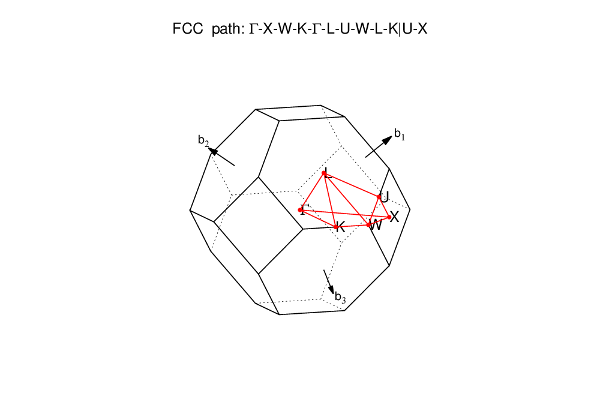

# AFLOWPY
> Python-binding interface to access resources in AFlowlib.org

## Features
+ Get all properties of materials in AFlowlib.org
+ Get all files of materials in AFlowlib.org
+ Coming soon

## Status
Working on it... 